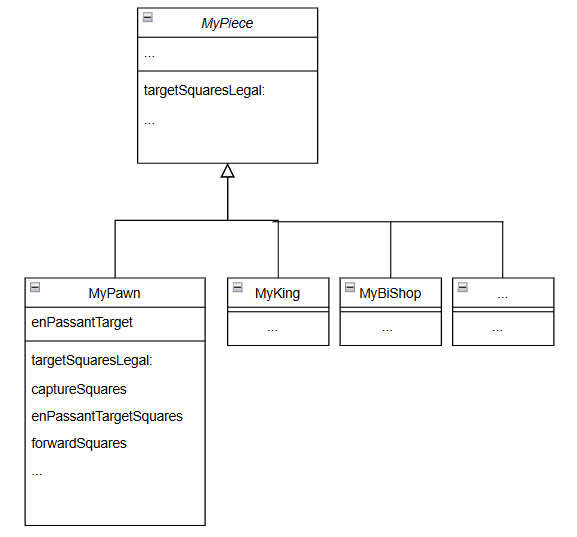
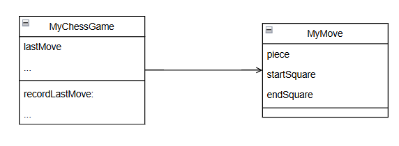

# Corriger les mouvements des pions !

## Introduction
Ce kata avait pour objectif principal de corriger les déplacements des pions dans un jeu d'échecs, en respectant les règles officielles. Les fonctionnalités à implémenter incluaient :
- L'avancée de deux cases au premier mouvement.
- Les captures diagonales des pièces adverses.
- Le mouvement spécial "en passant", qui constitue une exception complexe aux règles habituelles.

Nous avons choisi ce kata car il représentait une opportunité idéale pour pratiquer le Test-Driven Development (TDD) et aborder des problématiques de conception tout en consolidant nos compétences en programmation objet.

La stratégie adoptée pour ce kata a été de diviser les différentes fonctionnalités en commençant par les plus simples. En premier, nous avons résolu l'avancement de deux cases, puis corrigé les captures pour les rendre diagonales, et enfin terminé par le mouvement "en passant", en suivant une approche itérative.

## Difficultés rencontrées et solutions

### Difficultés

1. **Complexité du mouvement 'en passant'**  
   Les deux premières fonctionnalités ont été plutôt simples à implémenter, notamment la possibilité d'avancer de deux cases lors du premier mouvement et de corriger les captures des pièces adverses pour qu'elles soient diagonales au lieu de tout droit.  
   Cependant, le dernier point, le fameux mouvement "en passant", a été particulièrement difficile. En plus de contredire les règles précédentes (captures diagonales et avancée seulement tout droit), il permet au pion de se déplacer diagonalement sans pièce sur la case cible et de capturer une pièce derrière lui. De plus, cela doit se faire immédiatement après l'avancée de deux cases d'un pion adverse, car si un autre mouvement a été effectué entre-temps, la capture "en passant" n'est plus possible. La gestion de l'enregistrement du dernier mouvement a posé le plus de problèmes.  

2. **Choix entre plusieurs conceptions**  
   Le choix entre différentes implémentations/conceptions nous a souvent mis au défi. Parfois, plusieurs solutions étaient possibles, mais il fallait en choisir une seule. Laquelle ? C'est là que résidait le problème.  
   Par exemple, pour déterminer si un pion peut avancer de deux cases lors de son premier mouvement, nous pouvions :  
   - Relever les coordonnées des cases.  
   - Relever les cases par leur ligne.  
   - Définir un booléen.  

### Solutions

1. **Utilisation du debugger**  
   Notre fameux ami, le debugger, nous a beaucoup aidés à comprendre d'où venaient les anomalies. Il a permis de trouver la méthode qui posait problème et de corriger les instances ou variables incorrectes.  

2. **Jouer et jouer encore**  
   En testant sur l'interface du jeu, étant des personnes visuelles, nous avons pu nous remettre les idées en place.  

3. **Validation rigoureuse avec des tests**  
   Avant d'essayer d'implémenter une fonctionnalité, nous avons systématiquement identifié toutes les anomalies possibles. Nous avons créé de nombreux tests pour prévenir les incohérences.  

4. **Approche itérative**  
   L'implémentation des solutions a été divisée par fonctionnalité afin de réduire la complexité et de permettre des tests unitaires ciblés.  

## Tests et couverture du code

### Étendue des tests

1. **Tests automatisés**  
   Nous avons implémenté des tests unitaires pour nous assurer du bon fonctionnement des méthodes et également pour vérifier les fonctionnalités en cas de modifications dans le code, comme par exemple lors de la fusion des deux katas. Cela nous a permis de détecter rapidement si la fusion avait introduit des régressions.  

2. **Tests manuels**  
   Nous avons également beaucoup testé manuellement. Visuellement, sur le plateau de jeu, il était facile de vérifier si la fonctionnalité fonctionnait correctement.  

3. **Tests de mutation**  
   Nous avons également effectué des tests de mutation pour vérifier la robustesse de nos tests unitaires.  

## Décisions de conception

### Modèles de conception utilisés (ou non)

En ce qui concerne la conception pour gérer les déplacements, les captures et le mouvement "en passant" des pions, nous avons opté pour des solutions simples, comme en témoignent les UML ci-dessous :  

  
  

Dans ces UML, nous avons conservé l'héritage et le polymorphisme pour la classe `MyPawn`. Concernant les déplacements, nous avons utilisé la méthode `targetSquaresLegal`, dans laquelle nous concaténons des collections contenant les cases légales. Ces collections proviennent des méthodes `forwardSquares`, `captureSquares` et `enPassantTargetSquares`, correspondant respectivement à l'avancée en avant, aux captures diagonales et au mouvement "en passant".  

Pour le mouvement "en passant", nous avons décidé d'enregistrer le dernier mouvement d'une pièce dans une classe dédiée, comme l'indique l'UML ci-dessous. Cette classe contient trois informations : la pièce, la case de départ et la case d'arrivée. Cela nous permet de savoir si le dernier mouvement était celui d'un pion et s'il a avancé de deux cases. Une instance de `MyMove` est stockée dans la classe `Game`, qui réinitialise cette instance à chaque mouvement via la méthode `recordLastMove`.  

Nous n'avons pas utilisé de design pattern à proprement parler pour ce kata, mais uniquement les bases de la programmation orientée objet, qui étaient suffisantes dans ce cas. Nous avions cependant réfléchi à l'utilisation des patterns `State` et `Strategy` :  
- Avec le pattern `State`, le pion aurait eu différents états (état de départ, état normal), chaque état appliquant une stratégie différente.  
- Par exemple, dans l'état de départ, une stratégie aurait permis d'avancer de une ou deux cases, tandis que dans l'état normal, seule une case aurait été autorisée.  

Cependant, la première solution s'est avérée simple et efficace, ce qui a permis de garder un code moins complexe.  

### Pourquoi cette partie du code est-elle plus testée que l'autre ?

Nous avons naturellement concentré nos tests sur le code modifié et ajouté pour le kata, avec une attention particulière aux mouvements complexes tels que "en passant" et les captures. Ces fonctionnalités ont été plus testées en raison de leur complexité et de leur potentiel d'erreur élevé.

voici les liens des commits importants: 
https://github.com/UnivLille-Meta/Chess/commit/38fd2d41a6a787bac8cc01e72b7af005a712cea5
https://github.com/UnivLille-Meta/Chess/commit/6f89f8725c634f6f6b0f9b951561f95200b3de79

