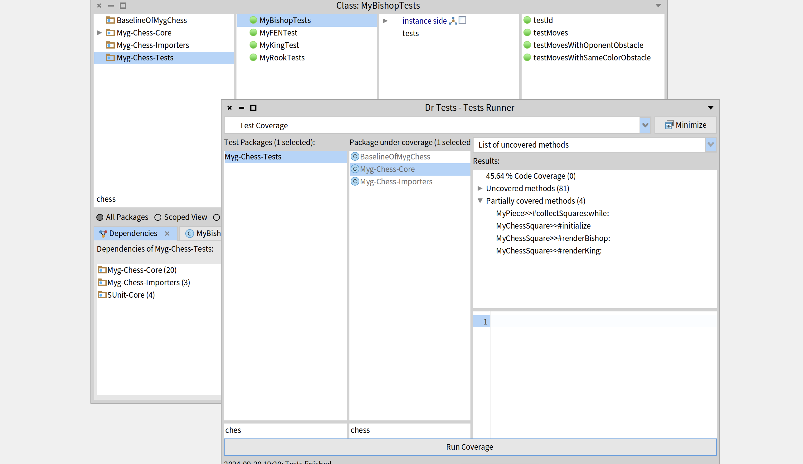

# Etudiants       

EL MANSOURI Yacine   
DASSI Helyana    
Année 2024-2025     


# Introduction 
Dans ce readme vous trouverez d'une part le guide d'installation et d'exécution du projet et d'autre part une étude préalable du projet. 
Vous trouverez l'avancement et les détails du dérouler des katas dans le paragraphe suivant.

## Katas choisis 
Nous avons détaillé nos katas dans deux fichiers README distincts : 
### Fix pawn moves! voici le lien : [Lien README pour le kata Pawn](FixPawnMoves.md)  

### Remove nil checks voici le lien : [Lien README pour le kata Nil](RemoveNilChecks.md)

# Importation du projet     

Pour importer notre projet, il faut préalablement ouvrir une image Pharo 12.0. Puis suivre les étapes suivantes :
- ouvrir un playground ( Browse > Playground )
- executer dans le playground le code suivant:
   
```
Metacello new
	repository: 'github://Yacineelmns/Chess:main';
	baseline: 'MygChess';
	onConflictUseLoaded;
	load.
```

# Execution du projet

Une fois le projet importé, vous pouvez l'executer en suivant les instructions suivantes :
- ouvrir un playground si vous n'en n'avez pas d'ouvert ( Browse > Playground )  
- executer dans le playground le code suivant :

```
board := MyChessGame freshGame.
board size: 800@600.
space := BlSpace new.
space root addChild: board.
space pulse.
space resizable: true.
space show.
```

# Comment interagissons-nous avec lui ?
Pour interagir avec le jeu d'échecs, plusieurs options s'offrent à vous :

Mode interactif :
Cliquez sur une pièce pour la sélectionner.
Cliquez ensuite sur la case où vous souhaitez déplacer cette pièce.
Mode automatique :
Appuyez sur le bouton "PLAY" pour que le jeu effectue un déplacement automatiquement.

## Où se trouvent le code et les tests ? Faut-il s'occuper de quelque chose ?
Code source : Le code principal du jeu est situé dans le package Myg-Chess-Core.
Tests : Les tests unitaires se trouvent dans le package Myg-Chess-Tests.

# Analyse préalable
Avant de réaliser la moindre modification, nous avons effectué une analyse approfondie du code afin de mieux comprendre la structure du projet et de préparer la refactorisation de notre kata.


## Analyse des packages :

- **Myg-Chess-Core** : Ce package contient la logique principale du jeu d'échecs.
Il regroupe les classes de base qui gèrent l'échiquier, les pièces et les cases.

- **Myg-Chess-Importers** :  Ce package est dédié aux importations.

- **Myg-Chess-Tests**: Ce package contient les tests unitaires permettant de vérifier le bon fonctionnement des différentes classes et fonctionnalités du jeu.


## Analyse de certaines classes dans Myg-Chess-Core

- **MyChessBoard** : Cette classe représente le plateau de jeu, mais elle permet également d'initialiser les pièces.
- **MyChessSquare** : Cette classe gère les cases de l'échiquier et leur contenu.
- **MyPiece** : Cette classe représente toutes les pièces du jeu. Chaque pièce redéfinit son propre mouvement.


## Résultats des Tests

Intéressons-nous aux différents tests unitaires effectués sur les composants clés du jeu d'échecs.

- **MyBishopTests** : 4 tests réussis.  
- **MyFENTest** : 3 tests réussis.  
- **MyKingTest** : 2 tests réussis sur les fonctionnalités liées au roi.  
- **MyRookTests** : 4 tests réussis pour la tour.  


## Analyse de la Couverture de Code

La couverture de code est un indicateur clé pour évaluer quelles parties du projet sont suffisamment testées.

Myg-Chess-Core : 45,64 % de couverture. Ce package central comprend la logique principale du jeu. 
 
 


 

 
