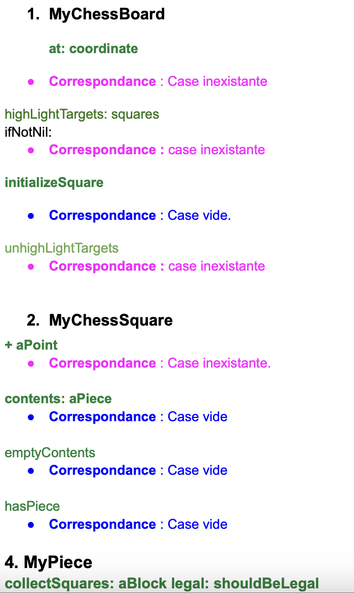

Nous avons choisi ce kata de refactorisation, qui consiste à supprimer les vérifications explicites de **nil** dans le code en utilisant le polymorphisme.

#### **Avoid Null Checks**
Avant de commencer toute modification, nous avons visionné la vidéo **Avoid Null Checks** de M. Guillermo pour mieux comprendre les bonnes pratiques associées à ce processus. Ce cours explique que nil est un objet représentant l'absence de valeur, mais son utilisation excessive entraîne des vérifications répétées qui alourdissent le code et le rend plus difficile à maintenir.

Pour éviter cela, il est recommandé d'utiliser le polymorphisme. Par exemple, au lieu de vérifier constamment si une variable est nil, on peut retourner une collection vide pour les listes ou 0 pour les nombres.

Cette vidéo nous a permis de mieux comprendre l’impact des nil sur la qualité du code et de constater qu'après leur suppression, le code devient plus lisible et ne nécessite plus de vérifications constantes.
Idée : 
On peut remplacer `nil` par un objet représentant une case vide en utilisant le polymorphisme et le pattern NullObject.
Cela rend le code plus lisible et maintenable, car tous les `nil` ne représentent pas forcément des cases vides, cela nous permettra aussi mieux distinguer les références aux cases vides des cases inexistantes.

### Méthodologie adoptée

Pour refactoriser le projet et supprimer les vérifications de nil nous avons suivi une approche structurée : 

1. **Identification des nil et analyse de leur rôle :**

Dans le projet, les nil sont censés représenter des cases vides ou inexistantes sur l'échiquier. Nous avons donc ciblé la classe MyChessSquare, qui est centrale puisqu'elle regroupe les principales méthodes pour gérer les cases.

2. **Analyse du code contenant des vérifications de nil**

Nous avons parcouru le code pour recenser les endroits où des vérifications de nil étaient présentes. Nous avons ensuite listé chaque instance de nil dans un doc, en indiquant sa correspondance (par exemple, une case vide ou inexistante)

3. **Création d'un document de suivi**

Pour organiser cette étape, nous avons créé un document récapitulatif regroupant tous les nil identifiés ainsi que leur correspondance
 Voici un extrait représenté par la photo ci-dessous :



#### Séparation du travail en deux parties

Après cette analyse, nous avons décidé de séparer le kata en deux parties pour mieux structurer notre refactorisation :

1. **Les nils représentant des cases vides** 
2. **Les nils représentant des cases inexistantes** 


##### 1. **Les nils représentant des cases vides** 
Voici les principaux commit même si il y a eu des changements mineurs
https://github.com/UnivLille-Meta/Chess/commit/90b6c1ca1056583f48dff452fe4d123cb188b3ff
https://github.com/UnivLille-Meta/Chess/commit/59f2b2c970ad32344ad10a88daffa2d8b5cedabd
 - Création de la classe MyEmptyPiece
Nous avons utilisé l'héritage pour créer la classe MyEmptyPiece, une sous-classe de MyPiece, afin de représenter une pièce vide. Cette classe encapsule le comportement des cases sans pièce :

```hasPiece``` : retourne false ce qui indique qu'il n'y a pas de pièce réelle sur la case (dans l'interface utilisateur il n'y a pas de pièce )

```targetSquaresLegal:``` : retourne une collection vide #() ce qui  indique qu'une case vide ne peut cibler aucune autre case    
`renderPieceOn:` : retourne un carre en appelant la méthode `renderEmptyPiece:` self car il n'y a rien à afficher sur une case vide

- Modification des méthodes utilisant nil avec une correspondance case vide  

Grâce au document créé précédemment, nous disposions déjà de la liste  des méthodes liées avec les correspondances cases vides. Nous avons donc directement remplacé les nil par des instances de MyEmptyPiece dans ces méthodes. 


AVANT refactorisation : 
```
aSquare contents isNil ifTrue: [ "..." ]
```

APRÈS refactorisation :
```
aSquare contents hasPiece ifFalse: [ "..." ]

```

Voici un UML simple des principales modififications effectuées : 


2. **Les nils représentant des cases inexistantes**
3. Voici les principaux commit même si il y a eu des changements mineurs
https://github.com/UnivLille-Meta/Chess/commit/6ff0bd035a14b1af6452eed2ab3ab43d080ba31a
https://github.com/UnivLille-Meta/Chess/commit/c3b37c29554060512da0d2d7e9759c8cc67d9a7d
https://github.com/UnivLille-Meta/Chess/commit/77e5933f5ab591cebd289f3bbac853c7f340ca67
 - Création de la classe MyOutOfBoundsSquare

Pour représenter une case inexistante (en dehors du plateau), nous avons créé la classe MyOutOfBoundsSquare, qui gère les comportements spécifiques aux cases hors plateau, sans utiliser nil.

isOutOfBounds return true pour indiquer une case hors plateau    
hasPiece return false car il ne peut y avoir de pièce sur cette case  
targetSquaresLegal: return #() car aucune pièce ne peut interagir avec une case inexistante


## **Réponse aux questions du kata**
### **1. Comment transformer les nil checks en polymorphisme ?**

Le polymorphisme remplace l'utilisation de nil grâce à MyEmptyPiece. Cette classe se comporte comme une pièce, mais avec des comportements spécifiques :
- Ne peut pas attaquer, se déplacer...
- Retourne toujours `false` pour `hasPiece` car ce n'est pas une vraie pièce

Comme dans l'exemple de code précédant le polymorphisme permet à MyEmptyPiece d'utiliser les mêmes méthodes que les autres pièces (MyBishop, MyKing..) tout en ayant un comportement adapté aux cases vides. Cela évite les vérifications explicites de nil dans le code et rend le comportement plus cohérent.
 
Pour les cases inexistantes, nous avons aussi utilisé le polymorphisme en créant la classe `MyOutOfBoundsSquare`, qui encapsule le comportement spécifique des cases inexistante au lieu de retourner `nil`, évitant ainsi les vérifications.

### **2. Quel type d’API devrais-je concevoir ?**

Nous avons conçu une API uniforme et cohérente basée sur le polymorphisme. (=API polymorphique)
Cette API permet d’interagir avec les cases de l’échiquier sans avoir besoin de connaître leur nature exacte (case vide, case ineexistante, ou case contenant une pièce)
Par exemple, toutes les cases (avec ou sans pièce) répondent de manière cohérente aux méthodes comme :
- `hasPiece` : si on souhaite savoir si une case contient une pièce.
- `targetSquaresLegal:` : si on souhaite connaître les cibles légales de la case (vide ou non). 

Toutes les pièces héritent de MyPiece.
La "pièce vide" sait comment se comporter dans toutes les situations :
Si on lui demande "Es-tu vide ?", elle répond "Oui" (car ```hasPiece``` return false)
Si on lui demande "Peux-tu te déplacer ?", elle répond "Non" 

La case inexistante, MyOutOfBoundsSquare, qui indique clairement qu'elle est hors plateau :

Si on lui demande "As-tu une pièce ?", elle répond "Non" 
Si on lui demande "Es-tu hors du plateau ?", elle répond "Oui".    
Les vraies pièces continuent de se comporter comme elles le font déjà, chacune ayant leur propre mouvement.
Les objets sont tous capable de repondre de manière coherente aux mêmes messages, que ce soit des pièces réelles ou vide.

 
### **3. Les tests peuvent-ils m’aider ?**
Oui, les tests ont été essentiels dans la refactorisation des nil pour les cases vides et inexistantes. Nous avons également testé les nouvelles classes créées pour garantir qu'elles respectaient le comportement attendu.


##### Étapes du processus de test : 

 1. Identification des méthodes à tester grâce au document qui indiqiue les correspondances

Chaque méthode avait un comportement spécifique, ce qui nous a permis de créer des tests ciblés pour vérifier plusieurs cas d'utilisation.

2. Création de tests pour vérifier le comportement attendu

Nous avons écrit des tests sur ces méthodes pour nous assurer qu'elles renvoyaient le bon résultat, même après modification. L'objectif était de garantir que le remplacement des nil par MyEmptyPiece ou MyOutOfBoundsSquare ne modifiait pas le comportement des ces methodes et du jeu :    
ex : Si la méthode devait indiquer qu'une case est vide elle devait toujours le faire après la refactorisation.

3. **Progression des remplacements et vérifications continues des changements**       

Pendant le remplacement des nil, nous avons lancé les tests unitaires étape par étape pour suivre l'évolution du projet.
Lorsque l'un des tests passait au rouge, cela nous montrait que nous avions changé par erreur le comportement attendu d'une méthode. Cela nous aidait à repérer rapidement l'erreur et à la corriger mais ce n'était pas tout le temps évident.

Nous avons également remarqué des bugs directement dans l'interface utilisateur en jouant des parties test.  
Exemple 1 : Lorsqu'on cliquait sur une case, la pièce ne se déplaçait pas et les marquages des cases cibles restaient visibles  
Exemple 2 : Les cases vides censées être colorées restaient entièrement blanches sur l'échiquier, due à un oublie de correction.

Ces problèmes apparaissaient souvent lorsqu'on oubliait de remplacer certains nil. Cela nous a appris qu’il était essentiel de remplacer tous les nil d'un coup pour éviter des incohérences. Chaque oubli pouvait entraîner un comportement bizarre du jeu, visible directement sur l'échiquier.
À force de vérifier, tester et ajuster, nous avons finalement remplacé l'ensemble des nil liés aux cases vides pour garantir une interface fonctionnelle.


**Comment on a fait face aux erreurs?**
Lors de la refactorisation, le débogueur et le Transcript ont été essentiels pour comprendre les erreurs et vérifier le bon fonctionnement des méthodes.
Lorsqu'un test devenait rouge ou qu'une erreur survenait en jouant, nous ouvrions le débogueur pour identifier où l'exécution s'arrêtait. Cela nous permettait de comprendre si le problème était lié à un oubli de remplacement de `nil` par `MyEmptyPiece` ou `MyOutOfBoundsSquare` ou à une méthode qui n'était pas encore adaptée pour gérer la nouvelles classes  


 ### **Un problème similaire se produit lorsqu'une pièce tente de se déplacer en dehors de l'échiquier. Pouvez-vous l'identifier et le corriger ?**
 Oui, nous avons créé la classe MyOutOfBoundsSquare pour représenter les cases inexistantes :

isOutOfBounds : retourne true.   
hasPiece : retourne false.   
targetSquaresLegal: : retourne une collection vide #().  
Les méthodes up, down, left, right retournent self pour éviter les erreurs que nous avons rencontré   
Le comportement des cases hors plateau est neutralisé. En appuyant sur le bouton *play*, on peut observer directement sur l'interface si une pièce tente de se déplacer sur une case inexistante.

### **Interface utilisateur**  
Comme il était difficile de comprendre ces déplacements dans le code, nous avons préféré ajouter un affichage visuel sur l'interface graphique (par exemple : si le roi souhaite se déplacer sur une case inexistante, il sera affiché `"K case inexistante"`). Cela permet de visualiser clairement lorsqu'une pièce tente d'accéder à une case hors plateau.  
 Cependant, si nous souhaitons éviter l’apparition de ces cases inexistantes dans le jeu, nous pouvons simplement décommenter la ligne de filtrage dans la méthode `basicTargetSquares` du roi :

 ```
MyKing >> basicTargetSquares 

    "The king can move one square on each direction including diagonals"
    ^ {
        square right.
        square up right.
        square up.
        square up left.
        square left.
        square down left.
        square down.
        square down right.
    } "si on souhaite filtre sur l'interface graphique lorsqu'on rencontre des cases nonexistente"
"select: [ :s | s isOutOfBounds not ]" 
 ```


       
 

# **Décisions de conception**  

## **1. Pourquoi le code est-il comme ça ?**  
**Partie : case vide**  
Nous avons décidé de créer une classe `MyEmptyPiece` qui nous a permis de remplacer, en utilisant le polymorphisme, les `nil` qui indiquaient une case vide comme expliqué précédemment.  
Avec `MyEmptyPiece`, chaque case vide devient un objet qui sait se comporter correctement dans toutes les situations sans avoir besoin de faire des vérifications comme auparavant (`ifNil: ...`).  

**Partie : case inexistante**  
Nous avons décidé de créer une classe `MyOutOfBoundsSquare` qui nous a permis de remplacer les `nil` représentant une case inexistante (en dehors de l'échiquier).  
Une case en dehors du échiquier ne doit jamais contenir de pièce ni pouvoir être une cible. La classe `MyOutOfBoundsSquare` encapsule ce comportement et simplifie les vérifications en évitant d'écrire des conditions pour tester les limites de l’échiquier.  

**Aspect graphique**  
Au niveau graphique, lorsqu'on appuie sur le bouton **Play** pour jouer, nous avons fait en sorte que lorsqu'une pièce tente de se déplacer en dehors de l'échiquier, cela soit directement affiché (par exemple avec le roi : `K case inexistante;`) pour mieux comprendre ce comportement.  

**Choix de séparation du refactoring**  
Nous avons fait le choix de séparer ce refactoring en deux parties (cases vides et cases inexistantes), car cela nous a permis de tester et valider chaque changement progressivement, sans introduire trop de modifications en une seule fois. Cela nous a aussi permis de corriger les bugs un à la fois.

##### **Pourquoi les parties liées aux cases vides et inexistantes sont-elles plus testées que d'autres ?**

Comme expliqué précédemment, pour garantir le bon comportement des méthodes après le remplacement des `nil` par `MyEmptyPiece` et `MyOutOfBoundsSquare`, nous avons testé les cas où ces méthodes sont utilisées. Si un test qui était vert au départ devenait rouge, cela indiquait un problème, et nous devions revoir la méthode ou la modification pour corriger l'erreur.
Nous avons voulu être sûrs que chaque modification respectait le comportement initial des méthodes sans introduire de bugs. Pour cela, à chaque étape, nous avons essayé d'exécuté des tests sur des cas concrets où ces méthodes étaient utilisées, l'affichage des pièces ou la gestion des limites du plateau.

Ces tests étaient nécessaire pour garantir le bon fonctionnement du jeu car les cases vides et inexistantes sont sollicitées dans presque toutes les interactions du joueur.


##### **Où avons-nous mis les priorités ?**

- **Remplacement des `nil` critiques :**   

  Nous avons priorisé de traiter les `nil` liés aux **cases vides** et **inexistantes** séparement car ils impactent directement les déplacements et la logique du jeu 

- **Vérification après chaque modification :**  

  Après chaque changement, nous avons exécuté des tests pour détecter rapidement les endroits à revoir et maintenir le comportement attendu des méthodes.
  Nous avons aussi tester directement le jeu pour vérifier son comportement.  


## **Où avez-vous utilisé (ou non) des modèles de conception dans le code et pourquoi ?**
 
 
Nous avons essayé d'appliquer le **pattern Null Object**, qui propose une API polymorphique et nous contraint à encapsuler des actions pour remplacer les `nil` par des objets spécifiques. Pour représenter une pièce vide, nous avons créé `MyEmptyPiece`, une sous-classe de `MyPiece`. Cette classe permet de simplifier le code et de réduire les vérifications explicites de `nil`, tout en offrant une interface cohérente pour toutes les pièces.  
Nous avons également utilisé ce pattern pour gérer les **cases inexistantes** en créant la classe `MyOutOfBoundsSquare`. Cette classe remplace les `nil` retournés lorsque l’on tente d’accéder à une position hors de l’échiquier par un objet qui gère son propre comportement (`isOutOfBounds`, `hasPiece`...). 

 

Nous avons également utilisé **l'héritage** et le **polymorphisme** en créant `MyEmptyPiece` comme sous-classe de `MyPiece` et `MyOutOfBoundsSquare`, afin de garantir une interface uniforme pour toutes les pièces, qu'elles soient réelles ou vides ou inexistante. Cela nous évite d'utiliser des conditions comme `ifNil:` dans le code.
 


### Compétences générales :

Demander de l'aide et des questions dans les listes de diffusion/discord/canaux de discussion

Pour ce kata, il n'y avait qu'environ 3 à 4 personnes qui travaillaient sur ce sujet. Nous avons donc échangé en cours ou directement par message pour expliquer nos solutions, en particulier sur la gestion des **cases vides**.  
Concernant les **cases inexistantes**, plus complexes à gérer, nous avons échangé avec un camarade. Nous avons expliqué notre solution en détail.


 


 


